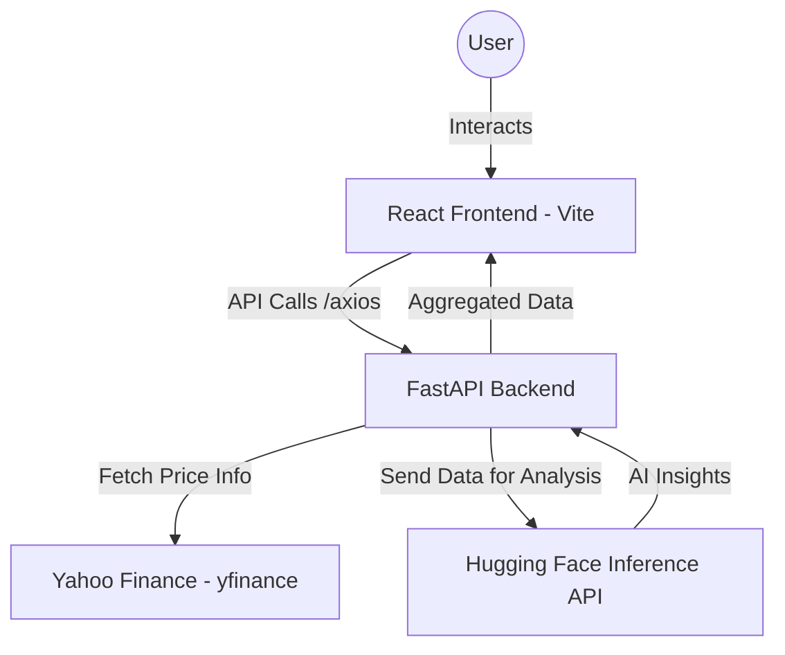

# RealTicker – AI-Powered Stock Insights Platform

RealTicker is a high-performance, full-stack application designed to provide users with rapid stock market overviews and deep AI-driven analysis of historical trends. Built for the Hackathon Technical Assessment.

## 🚀 Features

- **Top 10 Market Leaders**: Real-time dashboard showing the top performing stocks (AAPL, MSFT, NVDA, etc.) with live price changes and volume.
- **Historical Visualization**: Interactive 6-month price history charts with sleek gradients and smooth animations.
- **AI-Powered Insights**: One-click analysis using Hugging Face LLMs to identify trends, risk levels, and actionable investment guidance.
- **Premium UI/UX**: Built with a modern Glassmorphism theme, fully responsive and professionally styled.

## 🛠️ Tech Stack

- **Frontend**: React.js (Vite), Tailwind CSS, Framer Motion, Recharts, TanStack Query.
- **Backend**: Python (FastAPI), Uvicorn.
- **Data Source**: Yahoo Finance API (via `yfinance`).
- **AI Engine**: Hugging Face Inference API (`Mistral-7B-Instruct-v0.3`).

## 🏗️ Architecture



## 📋 Setup Instructions

### Prerequisites
- Node.js (v18+)
- Python (3.9+)
- Hugging Face API Token (optional for mock mode, required for live AI)

### Backend Setup
1. Navigate to the `backend` directory:
   ```bash
   cd backend
   ```
2. Install dependencies:
   ```bash
   pip install -r requirements.txt
   ```
3. Create a `.env` file and add your Hugging Face token:
   ```env
   HF_TOKEN=your_token_here
   ```
4. Run the server:
   ```bash
   python main.py
   ```
   The backend will be available at `http://localhost:8000`.

### Frontend Setup
1. Navigate to the `frontend` directory:
   ```bash
   cd frontend
   ```
2. Install dependencies:
   ```bash
   npm install
   ```
3. Run the development server:
   ```bash
   npm run dev
   ```
   The application will be available at `http://localhost:5173`.

## 🤖 LLM Implementation
The platform utilizes the **Mistral-7B-Instruct-v0.3** model via the Hugging Face Inference API. 
The system prompts the model with 6 months of OHLC (Open, High, Low, Close) statistical summaries and recent closing prices to generate:
- **Trend Detection**: (Upward, Downward, Sideways)
- **Volatility Assessment**: (Low, Medium, High)
- **Investment Guidance**: Concise, reasoning-based action plans for beginners.

---
*Disclaimer: This is AI-generated analysis and not financial advice.*
